# Gotchitama


## Table of Contents

* [Description](#description)
* [Technologies Used](#technologies-used)
* [User Story](#user-story)
* [Installation](#installation)
* [Usage](#usage)
* [License](#licence)
* [Preview](#preview)
* [Screenshots](#screenshots)
* [Deployed Heroku URL](#Deployed-Heroku-URL)

## Description

A web browser game, based on Tamagotchi and Pokemon, is created here where any number of users can sign up or login to the game and interact with their pet. While signing up, the users can select their favourite pet and then the users can feed and play with their pet, thereby increasing their health and speed levels. The users can also take their pet to battle against other users' pets where the pets could gain experience, level up and attain more modes of attack for the battle. This project is created using Node and Express web server and is backed by a MySQL database with Sequelize ORM. The project utilizes a new technology called passport.js and is deployed using Heroku with data. The project resembles MVC folder structure and utilize linter extension and travis-ci checks. The project uses Skeleton UI front end. The project also implements GET and POST routes for retrieving and adding new data. Enjoy the game (link given below).

## Technologies Used

* HTML5, CSS-Skeleton UI, Javascript, jQuery, Node.js, SQL, MVC, Handlebars, Travis-CI
* Various npm Packages: bcryptjs, express, express-session, mysql2, passport, sequelize, linter

## User Story

```
AS A gamer or pet lover

I WANT to be able to play with and take care of a digital pet

SO THAT I can feel a sense of companionship and accomplishment.


```

## Installation

```
npm i
```

## Usage

```
npm start
```

## Licence

This project is licensed under MIT 

[](https://opensource.org/licenses/MIT)

## Preview


## Screenshots
```
1. LOGIN PAGE
```
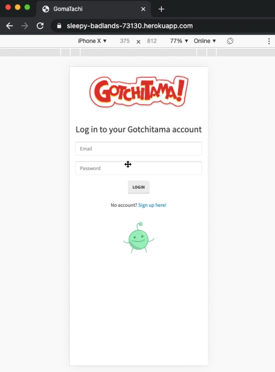

```
2. SIGNUP PAGE
```
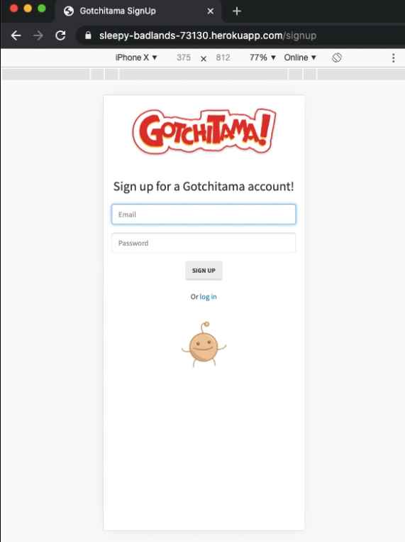

```
3. SELECT PET PAGE
```
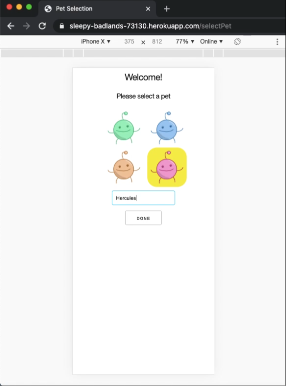

```
4. VIEW PET PAGE
```
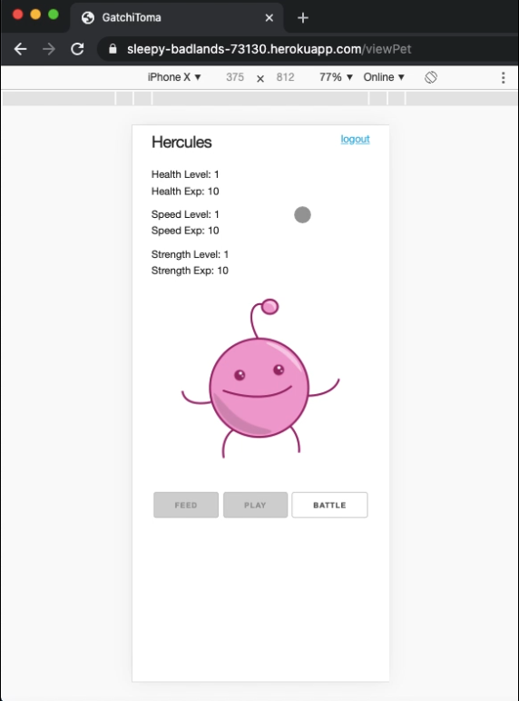

```
5. HUNGRY PET
```
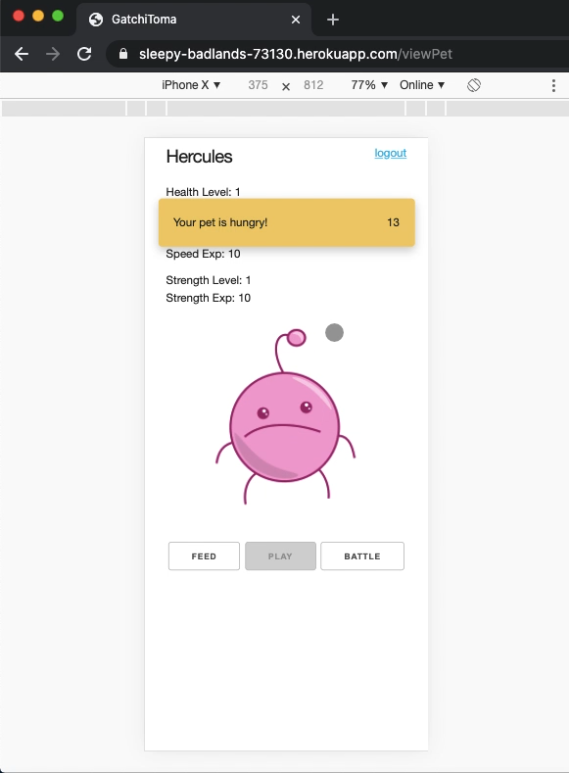

```
6. FEED PET
```
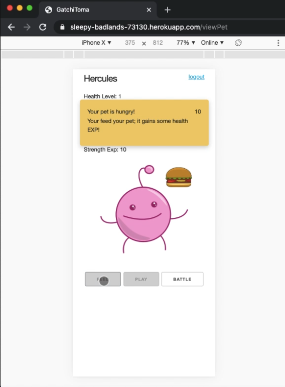

```
7. BORED PET
```
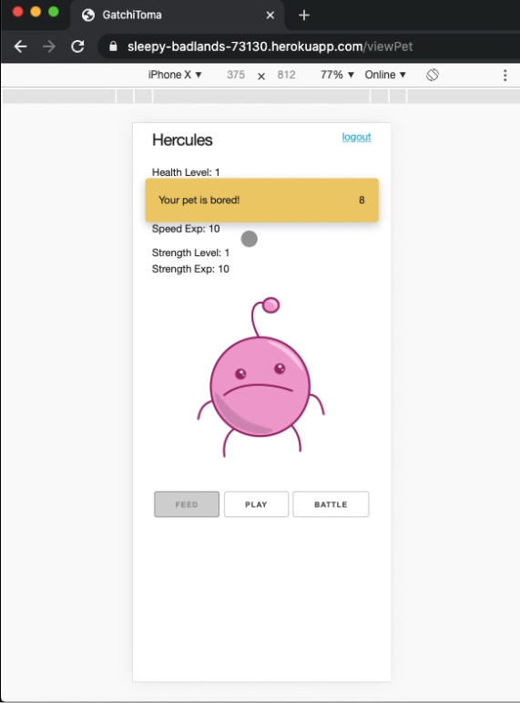

```
8. PLAY WITH PET
```
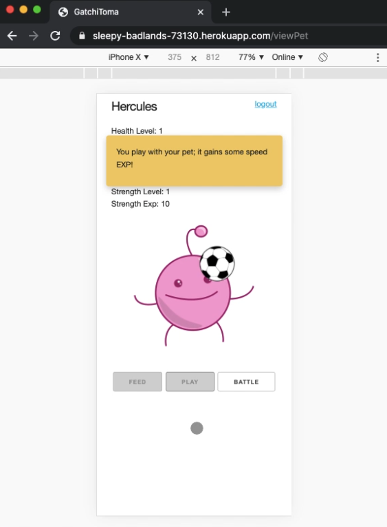

```
9. LOST HEALTH POINTS
```
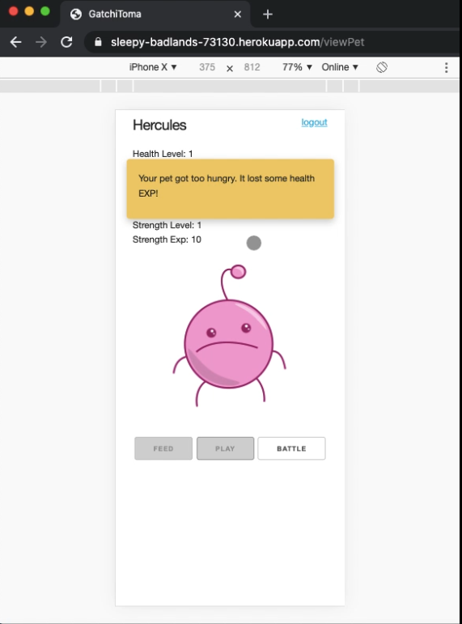

```
10. LOST SPEED POINTS
```
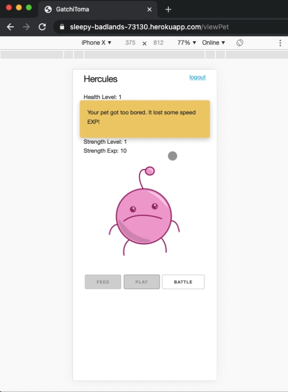

```
11. SELECT OPPONENT PAGE
```
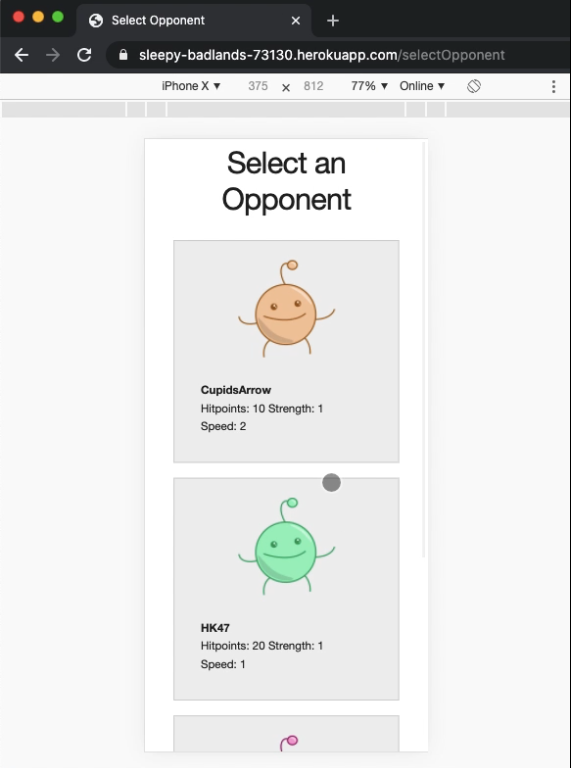

```
12. PET BATTLE PAGE
```
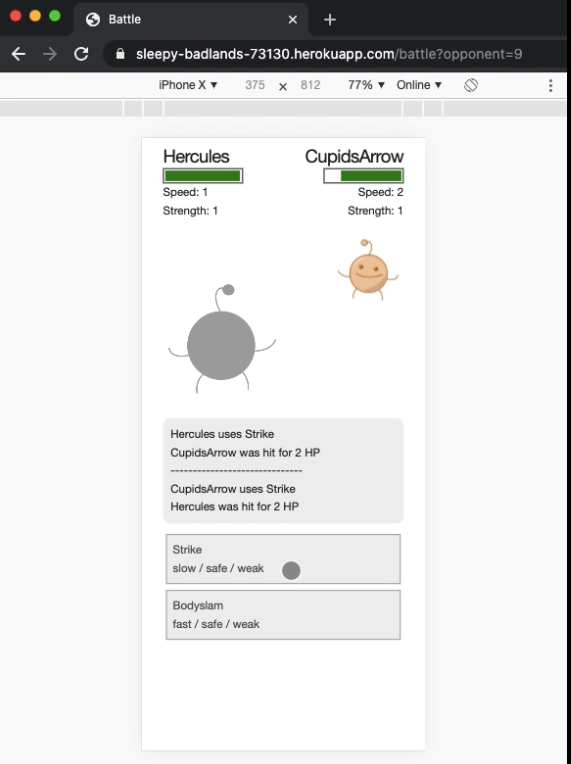

```
13. PET WON
```
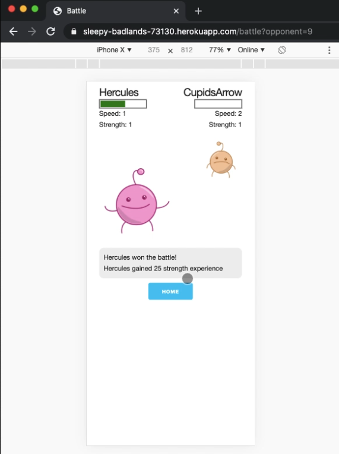

```
14. PET STAGE 2
```
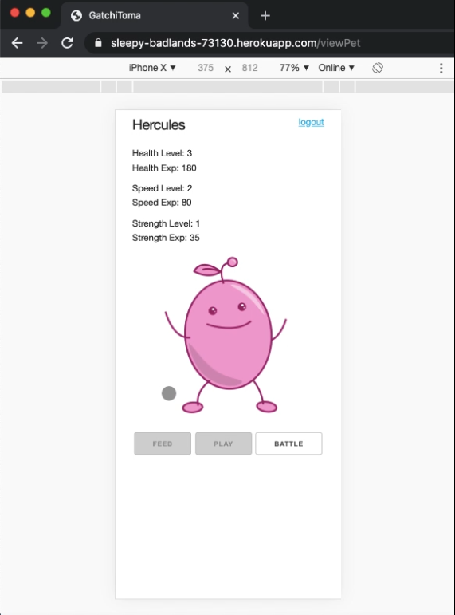

```
15. PET NEW STAGE 2 ATTACK - TACKLE
```
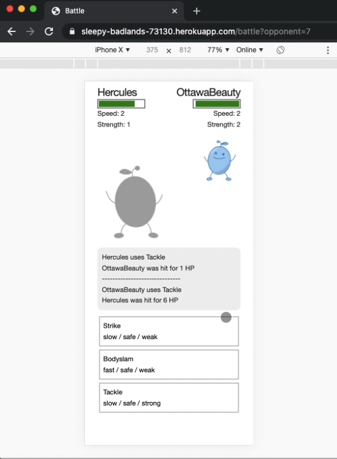

```
16. PET LOST
```
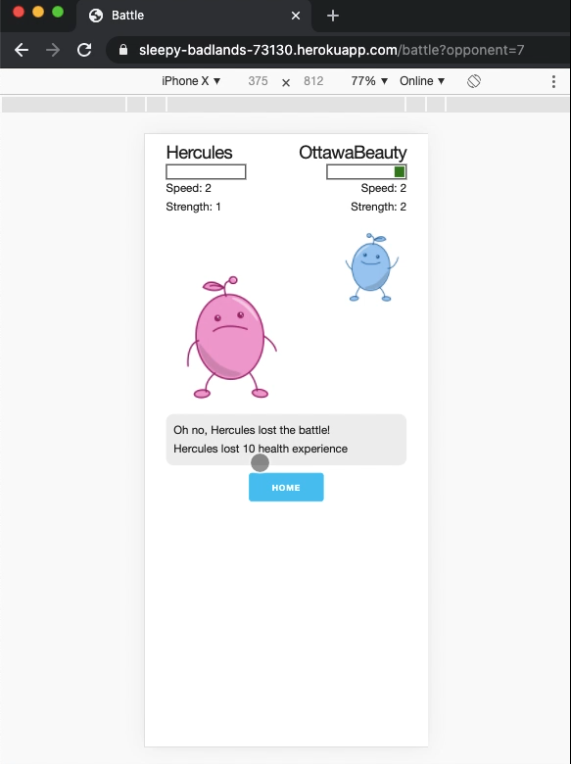

```
17. PET STAGE 3
```
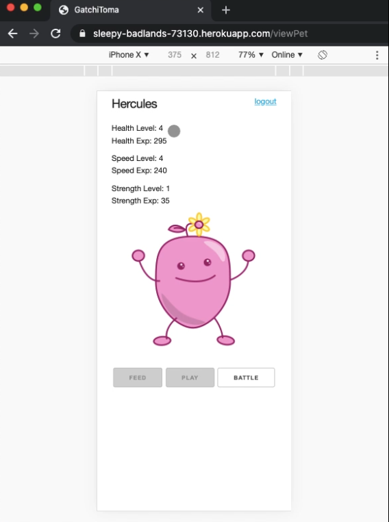

```
18. PET DODGED ATTACK
```
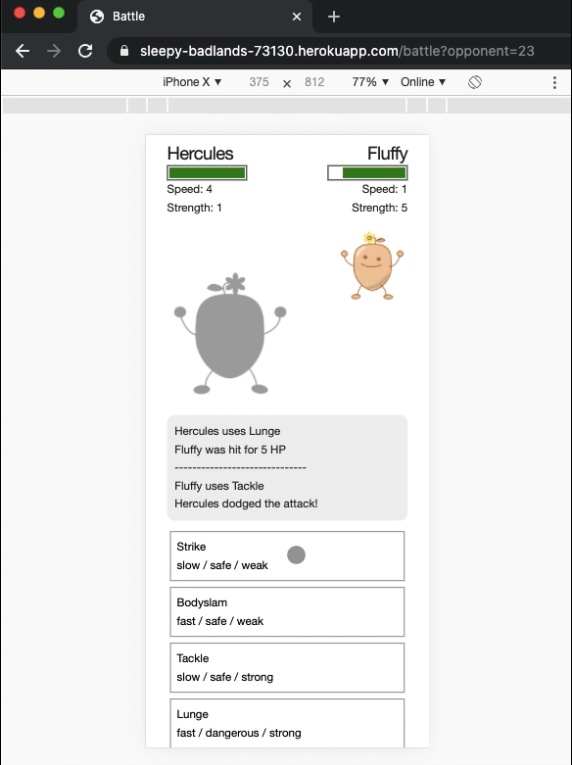


```
19. PET HURT ITSELF
```
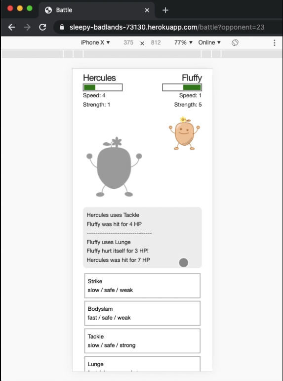


## Deployed Heroku URL
https://sleepy-badlands-73130.herokuapp.com/
